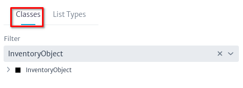
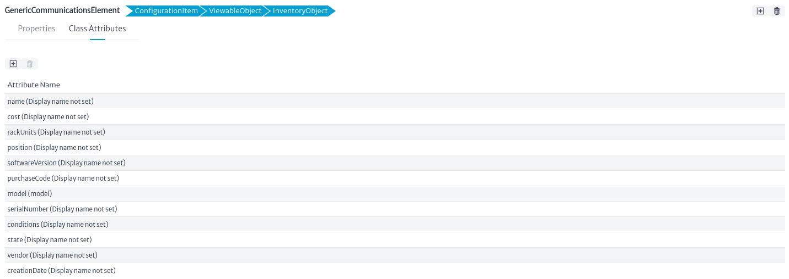
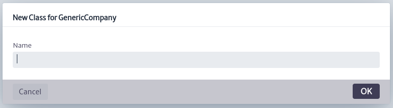
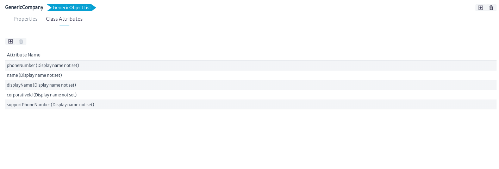

# Administrador de modelos de datos

Una de las características clave de Kuwaiba es que está completamente orientado a objetos[^1]. Significa que cada elemento de negocio (enrutador, ciudad, puerto) y de aplicación (usuarios, tipos) está representado por un **Objeto** en la aplicación y estos objetos son a su vez producto de una abstracción de la realidad llamada Clase.

Asimismo, cada atributo es un **Campo** en una clase. El conjunto de clases, atributos y relaciones entre ellos se llama **Modelo de Datos**. Hay un modelo de datos predeterminado, pero puedes personalizarlo dependiendo de sus necesidades agregando, eliminando y modificando clases. Para lograr esto, utilice el módulo *Administrador de modelo de datos*.

Para abrir el modulo de Administrador de de modelos de datos, seleccioné en el menu de opciones *Opciones -> Data Model Manager*.
||
|:--:|
| **Figura 1.** Selección de modulo de Administrador de modelo de datos en el menu general |

## Árbol de clases

El modelo de datos se representa como un árbol debido a su estructura jerárquica. Técnicamente, esto se conoce como una jerarquía de clases[^2]. En la parte superior de esta jerarquía se encuentra **InventoryObject**, el tipo de elemento más general en el modelo de datos. Sus subclases representan todos los elementos posibles que serán considerados activos del inventario.

||
|:--:|
| **Figura 2.** Árbol de objetos del inventario |

A medida que se profundiza en el árbol, las clases se vuelven cada vez más especializadas y cada nivel hereda los atributos de las clases superiores. Esta estructura tiene dos propósitos principales: primero, ayuda a organizar las clases en función de sus características comunes. Segundo, como se verá más adelante en este manual, permite aplicar operaciones a clases de nivel superior, que se propagarán a todas las subclases.

||
|:--:|
| **Figura 3.** Árbol de objetos del inventario expandido|

### Crear una nueva clase

Al seleccionar un ítem del *Árbol de Clases*, en la parte derecha se pueden observar dos pestañas. Este apartado también permite **Crear una nueva clase** que herede de la clase seleccionada, a través de la acción del botón , el cual lanzará el siguiente diálogo. En este ejemplo, se ha seleccionado *AdministrativeItem* en el Árbol de Clases.

||
|:--:|
| **Figura 5.** Crear nueva clase|

Las pestañas que se pueden ver son:

* **Propiedades:** La ventana Propiedades contiene las propiedades intrínsecas de la clase, como el nombre, la descripción, etc. Estas pueden contener cualquier tipo de carácter UTF-8 sin caracteres especiales ni espacios en blanco. Además, permite asignarle un ícono específico que se mostrará en el inventario para dicho objeto.
  Si la clase es abstracta (no se pueden crear instancias de clases abstractas, solo se utilizan para dar consistencia al modelo de datos). El atributo **contable** no se utiliza actualmente, pero debería usarse para marcar clases cuyas instancias pueden tener representaciones gráficas, pero en realidad no forman parte del inventario, como los **Slots**. **In Design** (En diseño) es solo una manera de marcar una clase como parte de una intervención continua del modelo de datos y, por lo tanto, las clases con ese atributo marcado como *TRUE* no se pueden instanciar. El **color** es el color del ícono cuadrado predeterminado que se utiliza para mostrar el objeto en un árbol o vista. Este ícono se utilizará siempre que el atributo **Small Icon** sea nulo. **Small Icon** es el ícono que se usará en los árboles y su tamaño no puede exceder los 16x16 píxeles. **Icon** es el ícono utilizado en las vistas y tiene un tamaño máximo de 32x32 píxeles.
    ||
    |:--:|
    | **Figura 6.** Propiedades del objeto seleccionado|

    > **Importante**
    > * Todas las clases creadas por el usuario tienen el estado **In Design** establecido como *TRUE* por defecto. No se podrán crear objetos a partir de estas clases hasta que se cambie a *FALSE*. Esta es una medida preventiva para facilitar las pruebas de cambios cuando se crean múltiples clases antes de pasar a producción.
    > * Como convención, todas las clases abstractas llevan el prefijo **Generic**. Sin embargo, algunas clases principales (como *InventoryObject* o *AdministratorItem*) son abstractas y no siguen esta convención. Se recomienda adherirse a esta norma siempre que sea posible. A menos que tenga un conocimiento profundo del sistema, evite renombrar o eliminar clases principales, especialmente las abstractas.

* **Atributos de la Clase:** Esta sección contiene los campos de clase (atributos). En la figura de abajo, la clase *AdministrativeItem* tiene dos atributos: creationDate y name.
  
  ||
  |:--:|
  | **Figura 7.** Atributos de la clase seleccionada|

  Haga clic en el botón junto al nombre del atributo para personalizarlo como se muestra en la figura de abajo.
  En esta ventana, puede modificar:
  * **name**: Cambie el nombre del atributo.
  * **displayName**: Cambie cómo se muestra el nombre.
  * **Description**: Proporcione una descripción para el atributo.
  * **Type**: Seleccione el tipo del atributo (la lista desplegable mostrará tipos primitivos como Cadena, Entero, Flotante, Largo, etc., y todos los tipos de listas no abstractas disponibles). Cuando cambia el tipo de un atributo, todas las instancias existentes se actualizarán para reflejar el cambio. Esto significa que los valores del atributo modificado se convertirán al nuevo tipo si es posible (por ejemplo, de enteros a cadenas). Si la conversión no es posible, el nuevo valor se establecerá en nulo.

  También puede gestionar las siguientes opciones para el atributo:
  * **Mandatory**: Si selecciona esta opción, cada objeto de esta clase debe tener un valor para este atributo. Si habilita esta opción y ya hay objetos creados de esta clase sin un valor no nulo para este atributo, se producirá un error.
  * **Unique**: Si está marcado, el valor de este atributo no puede repetirse en todos los objetos creados de esta clase o sus subclases. Antes de poder establecer un atributo de clase como único, debe verificar que el valor de este atributo en cada objeto creado de esta clase o sus subclases sea único.
  * **isVisible**: Habilita o deshabilita la visibilidad del atributo. Si no está marcado, el atributo no se mostrará en las hojas de propiedades de los objetos creados a partir de esta clase.
  * **Administrative**: Los atributos marcados como "Administrative" se mostrarán en una pestaña separada en la hoja de propiedades del objeto. Esto es útil para atributos que se utilizan sólo con fines administrativos y que podrían confundir al usuario final si se mezclan con los atributos normales.
  * **NoCopy**: Puede elegir qué atributos no deben transferirse de un objeto a otro en una operación de copia.
  * **order**: Se refiere al orden en que aparecerá este atributo en la hoja de propiedades.

  ||
  |:--:|
  | **Figura 8.** Propiedades del atributo seleccionado|

  > **Importante**
  > * Puede perder información al cambiar el tipo de un atributo. Asegúrese de que la conversión al nuevo tipo sea posible antes de realizar el cambio.  
  > * Si se añade, elimina o renombra atributos, los cambios solo se reflejarán en las hojas de propiedades de los objetos del inventario que se hayan abierto previamente una vez se vuelva a cargar la página donde se muestra dicho objeto.
  > * Se recomienda encarecidamente **no renombrar** las clases abstractas principales, ya que algunas de ellas se utilizan internamente para soportar muchas funciones. Renombrarlas puede desestabilizar el sistema.

  También puede crear  y eliminar  atributos haciendo clic en los botones correspondientes. En el caso de crear un nuevo atributo, se mostrará un cuadro de diálogo como el que se muestra a continuación, donde se solicitarán el *Name*, *DisplayName* y *Type*, cuya descripción se encuentra detallada en el párrafo anterior.

  ||
  |:--:|
  | **Figura 9.** Nuevo atributo de la clase seleccionada|

## Tipos de lista

Los tipos de lista son atributos que señalan un elemento dentro de un conjunto limitado de objetos. A diferencia de la mayoría de los atributos, que son de tipos primitivos como Cadena, Entero, Booleano, etc., algunos son más complejos, siendo en realidad objetos adicionales en la base de datos. Un ejemplo de esto son atributos como proveedor, que señala un objeto que contiene información sobre el proveedor del equipo (líneas de soporte, gerente de cuentas, etc.), o estado, que describe el estado operativo actual del equipo (Trabajando, No funciona, Almacenado, etc.). El estado en sí mismo es un objeto ya que puede contener información sobre los próximos estados permitidos.

Muchos objetos en la base de datos compartirán el mismo proveedor, al igual que muchos otros compartirán el mismo estado. En términos de bases de datos relacionales, esto puede considerarse como una relación de muchos a uno.

|
|:--:|
| **Figura 10.** Tipos de lista|

### Crear un nuevo tipo de lista

Seleccione una subclase en *GenericObjectList* o en una de sus subclases de utilidad, en la parte derecha se pueden observar dos pestañas. Este apartado también permite **Crear un nuevo tipo de listas**, a través de la acción del botón , el cual lanzará el siguiente diálogo. En este ejemplo, se ha seleccionado *GenericObjectList*.

||
|:--:|
| **Figura 11.** Crear nuevo tipo de lista|

Las pestañas que se pueden ver son:

* **Propiedades:** La ventana Propiedades contiene las propiedades intrínsecas de la clase, como el nombre, la descripción, etc. Estas pueden contener cualquier tipo de carácter UTF-8 sin caracteres especiales ni espacios en blanco. Además, permite asignarle un ícono específico que se mostrará en el inventario para dicho objeto.
  Si la clase es abstracta (no se pueden crear instancias de clases abstractas, solo se utilizan para dar consistencia al modelo de datos). El atributo **contable** no se utiliza actualmente, pero debería usarse para marcar clases cuyas instancias pueden tener representaciones gráficas, pero en realidad no forman parte del inventario, como los **Slots**. **In Design** (En diseño) es solo una manera de marcar una clase como parte de una intervención continua del modelo de datos y, por lo tanto, las clases con ese atributo marcado como *TRUE* no se pueden instanciar. El **color** es el color del ícono cuadrado predeterminado que se utiliza para mostrar el objeto en un árbol o vista. Este ícono se utilizará siempre que el atributo **Small Icon** sea nulo. **Small Icon** es el ícono que se usará en los árboles y su tamaño no puede exceder los 16x16 píxeles. **Icon** es el ícono utilizado en las vistas y tiene un tamaño máximo de 32x32 píxeles.
    ||
    |:--:|
    | **Figura 12.** Propiedades del objeto seleccionado|

    > **Importante**
    > * Todas las clases creadas por el usuario tienen el estado **In Design** establecido como *TRUE* por defecto. No se podrán crear objetos a partir de estas clases hasta que se cambie a *FALSE*. Esta es una medida preventiva para facilitar las pruebas de cambios cuando se crean múltiples clases antes de pasar a producción.
    > * Como convención, todas las clases abstractas llevan el prefijo **Generic**. Sin embargo, algunas clases principales (como *InventoryObject* o *AdministratorItem*) son abstractas y no siguen esta convención. Se recomienda adherirse a esta norma siempre que sea posible. A menos que tenga un conocimiento profundo del sistema, evite renombrar o eliminar clases principales, especialmente las abstractas.

* **Atributos de la Clase:** Esta sección contiene los campos de clase (atributos). En la figura de abajo, la clase *AdministrativeItem* tiene dos atributos: creationDate y name.
  
  ||
  |:--:|
  | **Figura 13.** Atributos de la clase seleccionada|

  Haga clic en el botón junto al nombre del atributo para personalizarlo como se muestra en la figura de abajo.
  En esta ventana, puede modificar:
  * **name**: Cambie el nombre del atributo.
  * **displayName**: Cambie cómo se muestra el nombre.
  * **Description**: Proporcione una descripción para el atributo.
  * **Type**: Seleccione el tipo del atributo (la lista desplegable mostrará tipos primitivos como Cadena, Entero, Flotante, Largo, etc., y todos los tipos de listas no abstractas disponibles). Cuando cambia el tipo de un atributo, todas las instancias existentes se actualizarán para reflejar el cambio. Esto significa que los valores del atributo modificado se convertirán al nuevo tipo si es posible (por ejemplo, de enteros a cadenas). Si la conversión no es posible, el nuevo valor se establecerá en nulo.

  También puede gestionar las siguientes opciones para el atributo:
  * **Mandatory**: Si selecciona esta opción, cada objeto de esta clase debe tener un valor para este atributo. Si habilita esta opción y ya hay objetos creados de esta clase sin un valor no nulo para este atributo, se producirá un error.
  * **Unique**: Si está marcado, el valor de este atributo no puede repetirse en todos los objetos creados de esta clase o sus subclases. Antes de poder establecer un atributo de clase como único, debe verificar que el valor de este atributo en cada objeto creado de esta clase o sus subclases sea único.
  * **isVisible**: Habilita o deshabilita la visibilidad del atributo. Si no está marcado, el atributo no se mostrará en las hojas de propiedades de los objetos creados a partir de esta clase.
  * **Administrative**: Los atributos marcados como "Administrative" se mostrarán en una pestaña separada en la hoja de propiedades del objeto. Esto es útil para atributos que se utilizan sólo con fines administrativos y que podrían confundir al usuario final si se mezclan con los atributos normales.
  * **NoCopy**: Puede elegir qué atributos no deben transferirse de un objeto a otro en una operación de copia.
  * **order**: Se refiere al orden en que aparecerá este atributo en la hoja de propiedades.

  ||
  |:--:|
  | **Figura 14.** Propiedades del tipo de lista seleccionado|

  > **Importante**
  > * Puede perder información al cambiar el tipo de un atributo. Asegúrese de que la conversión al nuevo tipo sea posible antes de realizar el cambio.  
  > * Si se añade, elimina o renombra atributos, los cambios solo se reflejarán en las hojas de propiedades de los objetos del inventario que se hayan abierto previamente una vez se vuelva a cargar la página donde se muestra dicho objeto.
  > * Se recomienda encarecidamente **no renombrar** las clases abstractas principales, ya que algunas de ellas se utilizan internamente para soportar muchas funciones. Renombrarlas puede desestabilizar el sistema.

  También puede crear  y eliminar  atributos haciendo clic en los botones correspondientes. En el caso de crear un nuevo atributo, se mostrará un cuadro de diálogo como el que se muestra a continuación, donde se solicitarán el *Name*, *DisplayName* y *Type*, cuya descripción se encuentra detallada en el párrafo anterior.

  ||
  |:--:|
  | **Figura 15.** Nuevo atributo de la clase seleccionada|

[^1]: Programación orientada a objetos [https://en.wikipedia.org/wiki/Object-oriented_programming](https://en.wikipedia.org/wiki/Object-oriented_programming)
[^2]:Jerarquía de clases [https://en.wikipedia.org/wiki/Class_hierarchy](https://en.wikipedia.org/wiki/Class_hierarchy)