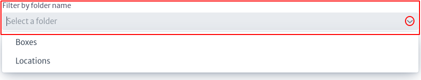

# Favoritos

El módulo Favoritos le permite organizar fácilmente los elementos a los que accede con frecuencia, sin necesidad de navegar profundamente entre los objetos. Para acceder a este módulo, diríjase a la sección de Navegación, identificada por el símbolo  en la parte superior de la pantalla, y luego seleccione la opción `Favorites`.

|  |
| :--: |
| ***Figura 1.** Acceso a modulo de favoritos.* |

Aparece una ventana emergente como la indicada en la Figura 2.

|  |
| :--: |
| ***Figura 2.** Modulo de favoritos.* |

Puede seleccionar un folder existente o crear uno nuevo. Para seleccionar uno existente, utilice la barra de búsqueda marcada como `Filter by Folder Name`, donde puede ingresar el nombre del folder deseado. Alternativamente, puede hacer clic en el icono  para desplegar una lista de carpetas existentes, tal como se muestra en la Figura 3.

|  |
| :--: |
| ***Figura 3.** Búsqueda de carpetas.* |

Al seleccionar un folder existente, se muestran los objetos que pertenecen a dicha carpeta junto con su estructura jerárquica, como se ilustra en la Figura 4. Al hacer clic en un objeto específico, aparece el Object Options Panel con la información del objeto, ubicado en la parte derecha de la pantalla y explicado detalladamente en el capítulo de Navegación. Además, encontrará la opción `Release From Folder`, la cual permite eliminar el objeto del folder seleccionado.

|  |
| :--: |
| ***Figura 4.** Vista de carpeta seleccionada.* |

Usted puede crear un folder nuevo, seleccionando el botón  donde aparece una nueva ventana solicitando el nombre del nuevo Folder, como se muestra a continuación.

|  |
| :--: |
| ***Figura 5.** Crear carpeta nueva.* |

Puede editar el nombre de un folder seleccionándolo desde el filtro mostrado en la Figura 3 y luego haciendo clic en el icono . Esto desplegará una ventana similar a la mostrada en la Figura 6, donde podrá ingresar el nuevo nombre de la carpeta. De igual manera, puede eliminar un folder seleccionando el icono . Es importante destacar que estos botones para editar y eliminar un folder solo estarán disponibles después de seleccionar un folder específico; de lo contrario, permanecerán deshabilitados.

|  |
| :--: |
| ***Figura 6.** Editar carpeta.* |

Para agregar un objeto a una carpeta de favoritos, vaya al `Object Options Panel` (explicado en el capítulo de Navegación) y encuentre la opción `Add to Folder` bajo `Basic Actions`. Luego, seleccione el folder donde desea agregar el objeto, como se muestra en la Figura 8.

|  |
| :--: |
| ***Figura 7.** Opción de agregar a favoritos.* |

|  |
| :--: |
| ***Figura 8.** Agregar objeto a favoritos.* |
