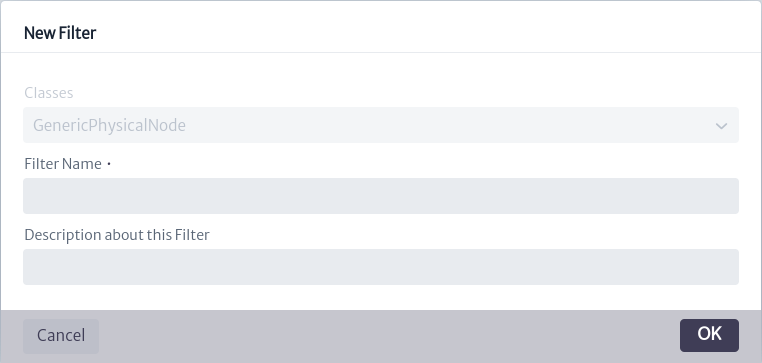

# Gestión de Filtros

Los filtros, como su nombre lo indica, filtran objetos del inventario de acuerdo a un criterio basado en un objeto previamente seleccionado.

Para acceder al módulo de filtros, ubique en el menú de la parte superior de la pantalla el icono  . Luego, aparecerá un nuevo menú horizontal en el que debe seleccionar la opción Filter Management, como se indica en la Figura 1.

|  |
| :--: |
| Figura 1. Acceso al módulo de filtros. |

Al acceder al módulo de filtros, se muestra la interfaz inicial, como se observa en la Figura 2, donde se listan todos los filtros existentes en la aplicación. Los recuadros rojos señalados, que se encuentran al lado del nombre de cada filtro, hacen referencia a las clases a las que pertenecen los filtros.

|  |
| :--: |
| Figura 2. Interfaz inicial del módulo de filtros. |

En la parte superior de la Figura 2, aparece un filtro de búsqueda identificado con `Classes`, donde el usuario puede buscar los filtros que pertenecen a una clase determinada ingresando o seleccionando la clase, como se muestra en la Figura 3. Señalado en el círculo rojo de la última figura mencionada, se encuentra el símbolo , que despliega una lista de las clases existentes para que el usuario seleccione la de su interés. Alternativamente, puede escribir el nombre de la clase en la caja de búsqueda y, a medida que escribe, aparecerán las clases que coinciden con la búsqueda.

|  |
| :--: |
| Figura 3. Selección de la clase de interés. |

Cuando el usuario selecciona una clase, los filtros pertenecientes a dicha clase se muestran en la pantalla, como se indica en la Figura 4.

|  |
| :--: |
| Figura 4. Filtros de una clase. |

Adicionalmente, se encuentra una segunda caja de búsqueda, que permite buscar filtros por coincidencia de nombre, como muestra la Figura 5.

|  |
| :--: |
| Figura 5. Búsqueda de filtros por nombre. |

Para crear un nuevo filtro, seleccione el icono , lo cual abrirá una nueva ventana emergente donde el usuario puede ingresar el nombre y una descripción del nuevo filtro. Si previamente ha utilizado la búsqueda de filtros por clases, la ventana emergente ya contendrá la clase con la que se realizó la búsqueda, es decir, el nuevo filtro creado será asociado a la clase previamente seleccionada, como se muestra en la Figura 6, en esta nueva ventana dicho valor no podrá ser modificado. En caso contrario, si no ha seleccionado una clase en el filtro de la Figura 3, la nueva ventana emergente para crear un nuevo filtro le permitirá seleccionar la clase a la cual pertenecerá el filtro, como indica la Figura 7.

|  |
| :--: |
| Figura 6. Crear filtro con clase previamente seleccionada. |

|  |
| :--: |
| Figura 7. Crear filtro sin clase previamente seleccionada. |

Cuando selecciona un filtro específico, el contenido del filtro aparece en la parte derecha de la pantalla. Además, en la parte superior derecha, se muestran cuatro botones señalados con un recuadro rojo en la Figura 8.

|  |
| :--: |
| Figura 8. Contenido del filtro. |

En la Figura a continuación se amplia la vista de los cuatro botones mencionados.

|  |
| :--: |
| Figura 9. Opciones de un filtro. |

* El icono  permite modificar el nombre y la descripción del filtro.
  
  |  |
  | :--: |
  | Figura 10. Editar un filtro. |

* El icono  elimina un filtro.
* El icono  guarda y compila el filtro (en caso de que hayan cambios en el script).
* El icono  permite al usuario habilitar o deshabilitar un filtro.

## Contenido de un Filtro

En primer lugar, hay que resaltar que el contenido de un filtro es representado en una clase que se adiciona al `classpath` de la aplicación, por ende, **se recomienda que la lógica del script sea sencilla, ya que en caso contrario, puede tener impactos significativos de rendimiento**.
  
En la Figura 8 se muestra el script del filtro, el cual contiene la lógica que define el propósito del filtro. A continuación, se explicará brevemente el contenido general que debe tener un filtro.

|  |
| :--: |
| Figura 11. Script del filtro. |

* Todos los filtros creados deben extender de la clase Filter, es decir la linea 16 de la Figura 11 debe ser exactamente igual en todos los filtros creados.
* Los filtros cuentan con un constructor que inyectan los Entity Managers (BussinesEntityManager, ApplicationEntityManager y MetadataEntityManager) junto con el ConnectionManger. Dicho constructor **no debe ser modificado por el usuario.**
* Todos los filtros contienen un método `run` que recibe la clase y el identificador del objeto, junto con algunos parámetros de los filtros. La firma de este método no debe ser modificada, pero su contenido sí puede ser alterado. Es dentro de este método donde el usuario inserta la lógica de lo que desea que el filtro haga. Es aquí donde puede hacer uso de los métodos de los diferentes EntityManagers mencionados anteriormente. Para ello, consulte la API de persistencia de Kuwaiba[^API_Kuwaiba]. Ademas, usando el ConnectionManager puede realizar sentencias cypher[^cypher] directamente en el filtro, aunque esta practica es poco recomendada.

Puede encontrar ejemplos de filtros en <https://sourceforge.net/p/kuwaiba/code/HEAD/tree/server/trunk/scripts/>. Los scripts de filtos contienen el prefijo `FT` en su nombre.

En el módulo de Navegación, al seleccionar un objeto que tiene filtros asociados, aparece una barra en la parte superior, señalada en la Figura 12. Por defecto, esta barra muestra el mensaje No Filter Selected. Al hacer clic en el ícono [list], se despliega una lista con todos los filtros disponibles asociados a la clase. Al seleccionar uno de estos filtros, se ejecuta y el resultado se refleja en los objetos, actualizando la lista inicial de acuerdo con el resultado del filtro, como se muestra en la Figura 13.

|  |
| :--: |
| Figura 12. Objeto seleccionado. |

|  |
| :--: |
| Figura 13. Resultado del filtro aplicado. |

[^Groovy]: Lenguaje Groovy: http://www.groovy-lang.org/
[^API_Kuwaiba]: API de Persitencia: https://kuwaiba.org/docs/dev/javadoc/current/
[^cypher]: Lenguaje de consulta de grafos de No4J: https://neo4j.com/docs/cypher-manual/3.5/introduction/