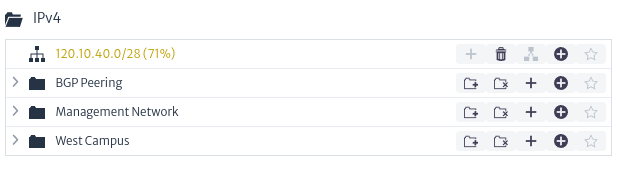

# Administrador de Direcciones IP

El *Administrador de Direcciones IP* (IP Address Manager) es una herramienta diseñada para gestionar direcciones IP de manera eficiente. Permite almacenar tanto direcciones IP individuales como sub-redes completas junto con sus IP asociadas. A través de esta herramienta, los usuarios pueden visualizar fácilmente qué direcciones IP están ocupadas y cuáles están disponibles en una red determinada. En resumen, el administrador de direcciones IP facilita la organización y control de la asignación de direcciones IP, contribuyendo a una gestión más efectiva de la infraestructura de red.

Para abrir el modulo de *Administrador de Direcciones IP*, seleccioné en el menu de opciones *Opciones -> IP Address Manager*.
||
|:--:|
| **Figura 1.** Selección de Modulo de Administrador de Direcciones IP en el Menu General |

Una vez abierto el modulo de *Administrador de Direcciones IP* se puede distinguir:
||
|:--:|
| **Figura 2.** Vista General del Administrador de Direcciones IP |

* **Explore from IPv4 Root:** Explorador para la gestión de direcciones IPv4.
  
||
|:--:|
| **Figura 3.** Botón de Explorador para la Gestión de Direcciones IPv4 |

* **Explore from IPv6 Root:** Explorador para la gestión de direcciones IPv6.

||
|:--:|
| **Figura 4.** Botón de Explorador para la Gestión de Direcciones IPv6 |

* **Barra de Búsqueda:** En la parte central de la pantalla se encuentra una barra de búsqueda que permite buscar una dirección IP o carpeta específica dentro de las colecciones de IPv4 y IPv6.

||
|:--:|
| **Figura 5.** Barra de Búsqueda |

* **Gestión de IPs:** Permite crear nuevas sub-redes o colecciones de sub-redes.

||
|:--:|
| **Figura 6.** Gestión de IPs |

* **Explorador de IPs:** Permite visualizar los elementos relacionados con una colección de direcciones IP, incluyendo sub-redes y otras colecciones de sub-redes.

||
|:--:|
| **Figura 7.** Explorador de IPs |

* **Propiedades del Elemento Seleccionado:** Permite visualizar las propiedades o características del elemento seleccionado. Por defecto, se muestra la imagen que se encuentra a continuación.

||
|:--:|
| **Figura 8.** Propiedades Elemento Seleccionado |
  
## Crear una Nueva Colección de Sub-redes

En la sección de Gestión de IPs, selecciona el botón mostrado en la imagen de abajo para agregar una nueva colección de sub-redes (Folder).

||
|:--:|
| **Figura 9.** Gestión de IPs |

Esta acción abrirá el cuadro de diálogo mostrado a continuación, donde se solicita el nombre de la nueva colección (Folder) y una descripción de la misma. El nuevo elemento agregado aparecerá en la sección de *Explorador de IPs*.

||
|:--:|
| **Figura 10.** Dialogo de creación de una nueva colección de sub-redes (folder) |

## Crear una Nueva Sub-red

En la sección de Gestión de IPs, selecciona el botón mostrado en la imagen de abajo para agregar una nueva sub-red.

||
|:--:|
| **Figura 11.** Gestión de IPs |

Esta acción abrirá el cuadro de diálogo mostrado a continuación, donde se solicitarán la dirección base de la sub-red y el prefijo de la sub-red en formato CIDR, junto con una breve descripción. En el mismo diálogo se proporcionará una descripción de los elementos que se van a configurar, incluyendo la dirección de broadcast, la dirección de red, el número de hosts y la máscara de sub-red, como se muestra en el diálogo a continuación. El nuevo elemento agregado aparecerá en la sección de *Explorador de IPs*.
||
|:--:|
| **Figura 12.** Dialogo de Creación de una Nueva Sub-red |

## Explorador de IPs

En este segmento podremos manipular tanto las colecciones de sub-redes como las sub-redes añadidas. A continuación se describen las opciones disponibles:

* **Opciones para Colección de Sub-redes (Folder)** :
  * **Agregar una Nueva Colección de Sub-redes (Folder)** : Crea una nueva colección de sub-redes dentro de la colección actual.
  * **Eliminar Colección de sub-redes (Folder)** : Elimina la colección.
  * **Agregar una Nueva Sub-red (Folder)** : Crea una nueva sub-red dentro de la colección.
  * **Agregar una Nueva IP** :  Crea una dirección IP dentro de una sub-red. Esto abrirá un diálogo como el mostrado en la figura de abajo, donde se solicita la IP a ingresar y una descripción.
    ||
    |:--:|
    | **Figura 13.** Nueva IP |
  * **Agregar a Favoritos** :Esta funcionalidad estará disponible en futuras versiones.

* **Opciones para Sub-red** :
  * **Agregar una Nueva Sub-red** : Crea una nueva sub-red dentro de la sub-red actual, ejemplo mostrado en la *Figura 12*.
  * **Eliminar Sub-red** : Elimina la sub-red.
  * **Divide una Sub-red** : Divide una sub-red basado en el prefijo de red como lo mostrado a continuación.
    ||
    |:--:|
    | **Figura 14.** Dividir una Sub-red |
  * **Agregar una Nueva IP** : Crea una dirección IP dentro de una sub-red. Esto abrirá un diálogo como el mostrado en la *Figura 15*, donde se solicita la IP a ingresar y una descripción.
    ||
    |:--:|
    | **Figura 15.** Crear Dirección IP no Reservada  |
    * **Crear IP no Reservada**: Como se muestra a continuación se crea una IP y esta quedara como *no reservada*. Después de ejecutar este comando con éxito, la opción de **Divide una Sub-red** quedara desactivada.
    * **Crear Todas las Direcciones IPs**: Como se muestra en la *Figura 16* se crean las direcciones IPs posibles para la sub-red seleccionada, todas las IPs creadas estarán *no reservadas*.
        ||
        |:--:|
        | **Figura 16.** Crear Todas las IPs |
    * **Crear IP Reservada**: Como se muestra a continuación se crea una IP y esta quedara como *reservada*, Después de ejecutar este comando con éxito, la opción de **Divide una Sub-red** quedara desactivada.
        ||
        |:--:|
        | **Figura 17.** Crear Dirección IP Reservada |
  * **Agregar a Favoritos** : Esta funcionalidad estará disponible en futuras versiones.

## Propiedades del Elemento Seleccionado

La imagen por defecto cambia según el elemento seleccionado, proporcionando información detallada sobre el mismo.

* **Colección de Sub-redes Seleccionada:** En la figura a continuación se muestran las sub-redes y direcciones IP creadas en la colección. También se puede observar si estas direcciones están libres, indicadas con el icono , y las reservadas con . Se presenta información básica como el nombre y la descripción.

  ||
  |:--:|
  | **Figura 18.** Propiedades de una Colección de Sub-redes |

* **Sub-red Seleccionada:** En la figura a continuación se muestra la sub-red con las direcciones IP creadas. También se puede ver si estas direcciones están enlazadas a algún elemento de red, indicado con el icono . Las IP libres se distinguen con el icono , y las reservadas con . Otros iconos corresponden a la lógica de validadores utilizada para el módulo. Además, se presenta información básica como el nombre, fecha de creación y datos cuantitativos, como el porcentaje de ocupación de la sub-red.

  ||
  |:--:|
  | **Figura 19.** Propiedades de una Sub-red |

## Relacionar una Interfaz de Red con una IP

En el módulo de *Administrador de Direcciones IP*, es posible relacionar una interfaz de red con una dirección IP específica. Esta funcionalidad se encuentra en la acción disponible para los puertos del módulo del [Árbol de Navegación](../navman/README.md) (Navigation Tree).
||
|:--:|
| **Figura 20.** Árbol de Navegación Puerto Optico |

Para relacionar una interfaz de red con una IP, navega hasta el puerto deseado en el árbol de navegación. En el menu de *Acciones Avanzadas* (Advances Actions) selecciona la acción *Relacionarse con la Dirección IP* (Relate to IP Address).

||
|:--:|
| **Figura 21.** Acción en el Árbol de Navegación para Relacionar Interfaz de Red con IP |

En el cuadro de diálogo, selecciona la dirección IP que deseas asociar.
||
|:--:|
| **Figura 22.** Dialogo de Relacionar Interfaz de Red con IP |

## Colores e Íconos

Los colores e íconos utilizados en el *Administrador de Direcciones IP* provienen de un validador en el módulo de configuración. Estos ayudan a visualizar rápidamente el estado de las direcciones IP.

||
|:--:|
| **Figura 23.** Colores e Íconos de Validación |

### Iconos

* **Icono de IP Libre**: Indica que la IP está libre.
* **Icono de IP Reservada**: Indica que la IP está reservada.
* **Icono de IP Relacionada**: Indica que la IP está asociada con un elemento de red.

### Colores

Los colores mostrados en las direcciones IP serán similares a los presentados en la gráfica. En este ejemplo, se utiliza el verde para las direcciones libres, el azul para las usadas y el gris para las reservadas.
||
|:--:|
| **Figura 24.** Colores de Direcciones IP |

## Relación entre Elemento de Red y Direcciones IP

Cada dirección IP puede estar asociada con diferentes servicios en la red. Al visualizar las propiedades de una IP, puedes ver los servicios asociados y sus estados.

||
|:--:|
| **Figura 25.** Relación entre Elemento de Red y Direcciones IP |

* **Direccion IP (IP Address):** Direccion IP.
* **Servicio (Service):** Servicio relacionado.
* **Interfaz de Red (Network):** Interfaz de red relacionada con la direccion IP. Al hacer clic en el ícono , la IP se desvinculará inmediatamente del elemento.
* **Dispositivo/Localización (Device/Location)**: Indica que la IP está asociada con un elemento de red.

## isManagementInterface

El campo `isManagementInterface` indica si un puerto es una interfaz de administración de un dispositivo (como un router). Esta designación es crucial para identificar el puerto a través del cual se administra el dispositivo, en lugar de ser utilizado para tráfico de comunicaciones regulares.

||
|:--:|
| **Figura 26.** Atributo isManagementInterface |

* **Propósito:** Indicar que este es el puerto de administración del router y no un puerto de comunicaciones.
* **Importancia:** Garantiza que siempre se asigne una IP a la interfaz de administración para poder acceder y gestionar el dispositivo.
