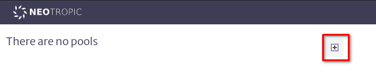
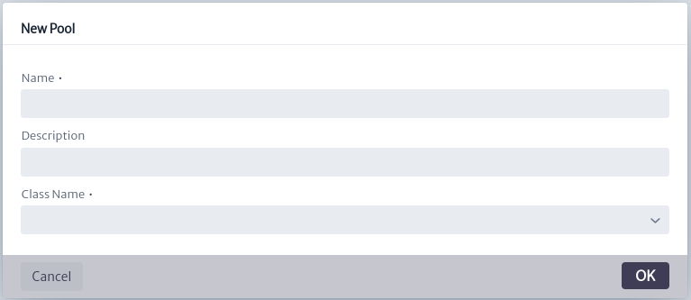
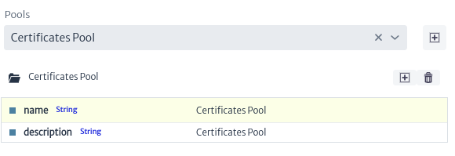
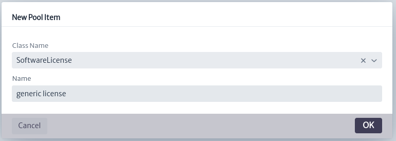
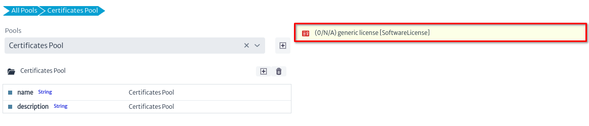
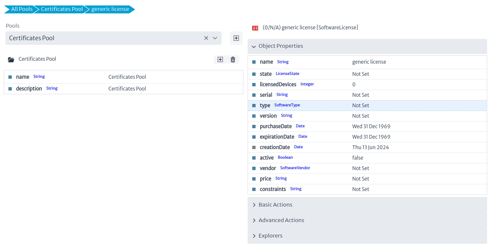

# Colecciones

El módulo de *Colecciones* (Pools) se refiere a un grupo de recursos gestionados colectivamente para optimizar su uso y disponibilidad. En términos simples, un "pool" es un depósito compartido de recursos similares que pueden ser utilizados por diferentes partes o procesos dentro de un sistema y que no se pueden colocar en el árbol de navegación estándar. La mayoría de estos recursos son elementos lógicos o administrativos, como VLANs o VPNs. Puedes imaginar una colección como una bolsa donde se colocan recursos que no tienen un lugar específico en la estructura tradicional.

Para abrir el modulo de *Colecciones*, seleccioné en el menu de opciones *Opciones -> Pools*.
||
|:--:|
| **Figura 1.** Selección de modulo de Colecciones en el menu general |

Una vez abierto el modulo de *Colecciones* se podrá agregar una nueva colección, para ello ubique el botón *New Pool* representado por el símbolo de agregar , como se muestra en la figura de abajo.
||
|:--:|
| **Figura 2.** Creación de una nueva colección |

Una vez accionado, se abrirá la ventana para crear una nueva colección. En el cuadro de diálogo, se le pedirá que ingrese el nombre de la nueva colección, su descripción y el tipo de objetos que desea almacenar en su interior. Si elige, por ejemplo, "Router", solo podrá almacenar instancias de Router. Sin embargo, si selecciona una clase abstracta (cualquiera que comience con "Genérica" o una de las clases principales como InventoryObject o ViewableObject), podrá colocar instancias de cualquiera de sus subclases.
||
|:--:|
| **Figura 3.** Dialogo de creación de una nueva colección |

Una vez creado, puede editar el nombre y la descripción de los atributos del grupo en la hoja de propiedades.
||
|:--:|
| **Figura 4.** Atributos de la colección |

Para gestionar la nueva colección, utiliza los botones ubicados junto al nombre de la colección.
Puedes eliminarla con el botón  o agregar un nuevo elemento haciendo clic en el ícono de agregar , como se muestra en la figura a continuación.
||
|:--:|
| **Figura 5.** Creación de un nuevo elemento dentro de una colección |

Una vez activado, se abrirá la ventana para crear un nuevo ítem en la colección. En el cuadro de diálogo, se le pedirá que ingrese el nombre del nuevo ítem y seleccione el tipo de objeto que representa.
||
|:--:|
| **Figura 6.** Dialogo de creación de una nuevo item de la colección |

El nuevo item creado aparecerá en la parte derecha de la pantalla como se muestra en la figura de abajo
||
|:--:|
| **Figura 7.** Nuevo item creado |

Para modificar las propiedades del nuevo ítem, haga clic sobre su nombre. Se mostrarán sus atributos, así como las acciones y exploradores asociados, como se muestra en la figura a continuación.
||
|:--:|
| **Figura 8.** Nuevo item propiedades |

Las acciones básicas, como eliminar para borrar el ítem seleccionado, avanzadas y exploradores se describen en el capítulo [Object Dashboard](./dashboards/object/README.md). Sin embargo, las acciones mostradas en la imagen a continuación son específicas de este módulo y se describen a continuación.
||
|:--:|
| **Figura 9.** Nuevo item creado |

| Acción    | Descripción                        |
|--------------|------------------------------------|
| **Copy to pools**| Copia el item seleccionado de a una nueva colección |
| **Move to pools**| Mueve el item seleccionado de a una nueva colección |
