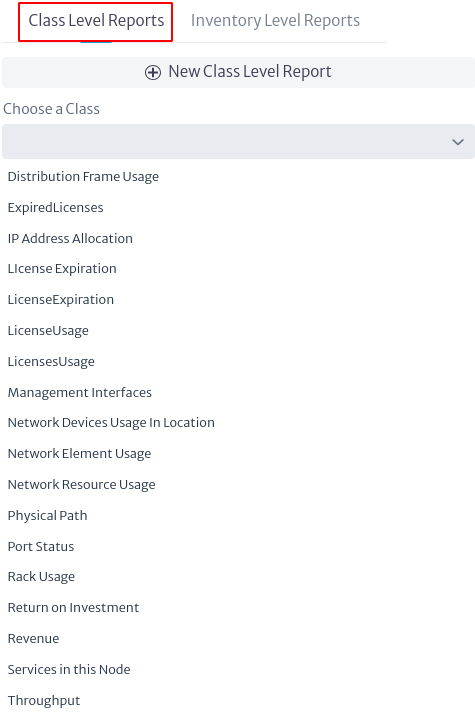
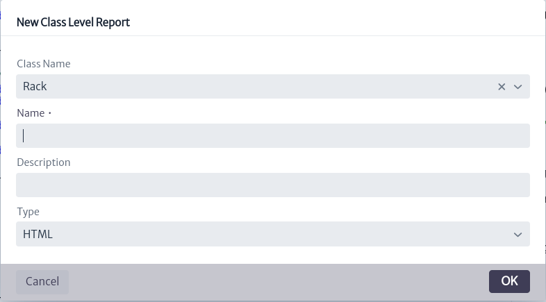
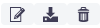

# Reportes

En Kuwaiba, los reportes son documentos en formato HTML diseñados para proporcionar información detallada sobre los objetos que forman parte del inventario. Su objetivo es informar y dar seguimiento a situaciones específicas.
A partir de la versión 1.1 los usuarios pueden crear sus propios reportes usando scripts de groovy[^groovy], para ello, se suelen seguir tres pasos:

   1. Recuperar los datos: Ya sea realizando una consulta directamente en la base de datos o utilizando la API de alto nivel proporcionada por Kuwaiba. En el primer caso, el usuario deberá tratar con los nodos en bruto y las relaciones contenidas en la base de datos gráfica y es muy probable que tenga que utilizar Cypher[^cypher]. En el segundo caso, tendrá que utilizar la API Java documentada[^api_kuwaiba].
   2. Procesamiento de la información: Consiste en tomar los datos recuperados de la base de datos y realizar cálculos, filtrados y otros procesamientos para convertirlos en información con sentido.
   3. Formateo y visualización: Que consiste en crear una estructura de tablas, etiquetas y/o gráficos para presentar la información de forma clara y fácil de leer.

Para acceder al módulo de reportes, ubique en el menú presentado en la parte superior de la pantalla la sección `Others`, representada con el símbolo de lista . Al acceder a esta sección, se desplegará un menú vertical en donde se puede observar el modulo de `Reports`, como indica la Figura 1.

|  |
| :--: |
| ***Figura 1**. Acceso a módulo de reportes.* |

Existen dos tipos de reportes: los reportes a nivel de clase y los reportes a nivel de inventario. Ambos se explican en las subsecciones siguientes.

## Reporte a Nivel de Clase

Estos informes están vinculados a las instancias de una clase determinada. Desde el modulo de reportes usted puede observar los reportes a nivel de clase ingresando a la opción `Class Level Reports` señalada en el recuadro rojo de la Figura 2, donde se listan todos los reportes a nivel de clase existentes.

|  |
| :--: |
| ***Figura 2**. Reportes a nivel de clase.* |

Para filtrar los reportes por clase, utilice la barra de búsqueda indicada con `Choose a Class` en la Figura 3. Aquí podrá ver todas las clases disponibles dando click en el botón  y seleccionar una, ya sea buscándola directamente en la lista desplegable o ingresando el nombre de la clase. Al seleccionar una clase específica, como `Rack`, aparecerán únicamente los reportes correspondientes a esa clase, tal como se muestra en la Figura 4.

|  |
| :--: |
| ***Figura 3**. Selección de clase.* |

|  |
| :--: |
| ***Figura 4**. Reportes por clase.* |

Para crear un nuevo reporte, seleccione el botón  que se muestra en la Figura 2. Al hacer clic en este botón, se abrirá una nueva ventana (Figura 5) donde puede escoger la clase a la que pertenece el reporte, ingresar el nombre, una descripción y elegir el tipo de reporte, que en este caso está disponible únicamente en formato HTML.

|  |
| :--: |
| ***Figura 5**. Crear reporte a nivel de clase.* |

> Nota: Si previamente ha filtrado los reportes por clase antes de crear uno nuevo, al abrir la ventana de creación, el campo Class Name aparecerá por defecto con la clase que fue seleccionada en el filtro.
> **Importante.** En el campo Type de la Figura 5, al desplegar la lista de los posibles tipos, aparece `CSV`, `PDF`, entre otros. Su selección aún no está disponible en esta versión.

Para visualizar y modificar el contenido de un reporte específico, selecciónelo. El contenido del reporte se muestra en la parte derecha de la pantalla, como indica la Figura 6.

|  |
| :--: |
| ***Figura 6**. Contenido de un reporte.* |

En la parte derecha de la Figura 6 se muestra el script de Groovy utilizado para el reporte específico, el cual puede editarse directamente desde esta ventana.

En la parte superior derecha de la Figura 6, se pueden observar tres botones. Se amplía esta imagen en la Figura 7.

|  |
| :--: |
| ***Figura 7**. Opciones de reporte.* |

* El icono  permite al usuario modificar las propiedades del reporte seleccionado. Al hacer clic en él, se abre una nueva ventana como se muestra a continuación, donde el usuario puede cambiar el nombre del reporte, modificar su descripción, y habilitar o deshabilitar el reporte.
  
  |  |
  | :--: |
  | ***Figura 8**. Editar propiedades de un reporte.* |

    > **Importante.** El botón `Enabled` permite habilitar o deshabilitar el reporte, lo cual determina si puede ejecutarse o no. Un reporte solo puede ejecutarse si está habilitado. Al crear un reporte, este por defecto se encuentra habilitado.

* El icono  permite guardar los cambios realizados en el script. Si el usuario ha modificado el script de Groovy del reporte, es necesario que seleccione este botón para que sus cambios sean guardados.
* El icono  elimina un reporte.

Un reporte a nivel de clase está diseñado para aplicarse a todos los objetos del inventario que pertenezcan a una clase específica. Para ejecutar este tipo de reporte, puede hacerlo desde cualquier objeto del inventario que sea parte de esa clase. Por ejemplo, si seleccionamos un objeto del inventario que pertenece a la clase `Rack`, desde el módulo de Navegación (detallado en el capítulo Navigation), buscamos un Rack. En el panel de opciones del objeto, encontramos las acciones básicas disponibles, donde se incluye la opción denominada Reports, como se muestra en la Figura 9.

|  |
| :--: |
| ***Figura 9**. Opción Reportes en el panel de opciones del objeto.* |

Al seleccionar la opción `Reports` de la Figura 9, aparece una nueva ventana con los reportes asociados a la clase Rack, es decir los reportes que pueden ser ejecutados desde dicho objeto, como indica la Figura 10.

|  |
| :--: |
| ***Figura 10**. Reportes disponibles.* |

Al seleccionar un reporte, se abre una nueva pestaña en el navegador con resultado del reporte en HTML.

|  |
| :--: |
| ***Figura 11**. Resultado del reporte.* |

> **Nota:** Los reportes que pertenecen a clases abstractas son aplicables a sus subclases. Por ejemplo, si se crea un reporte para la clase `GenericLocation`, este estará disponible para sus subclases como `Building`, `House`, `Neighborhood`, entre otras.

## Reporte a Nivel de Inventario

Estos informes no están vinculados a los objetos del inventario. En su lugar, se utilizan para mostrar información de propósito general, como "Todos los contratos de soporte a punto de expirar" o "Todos los objetos de inventario con estado operativo Defectuoso". Para estos informes, se pueden definir parámetros personalizados, a diferencia de los informes a nivel de clase que solo tienen como parámetro el objeto que inicia el informe. Los parámetros siempre se capturan como cadenas, y es necesario analizar y asegurar que coincidan con el formato correcto al inicio del informe.

Para observar los reportes existentes a nivel de inventario, seleccione la opción `Inventory Levels Reports` que aparece en el modulo de reportes, como se observa en la Figura 12, esto listará todos los reportes a nivel de inventario existentes.

|  |
| :--: |
| ***Figura 12**. Reportes a nivel de inventario.* |

Puede filtrar los reportes por su nombre, en caso de que requiera buscar alguno en particular, esto lo hace en el campo `filter` indicado en la Figura 13. Si selecciona el símbolo  aparecerán todos los reportes listados y, a medida de que escriba en la barra de búsqueda, los resultados que se le mostraran en dicha lista se van limitando a su búsqueda.

|  |
| :--: |
| ***Figura 13**. Filtro de reportes a nivel de inventario.* |

Usted puede crear reportes a nivel de inventario, haciendo click en el botón , lo que abrirá una nueva ventana donde puede ingresar el nombre, una descripción y elegir el tipo de reporte, que en este caso está disponible únicamente en formato HTML.

|  |
| :--: |
| ***Figura 14**. Filtro de reportes a nivel de inventario.* |

> **Importante.** En el campo Type de la Figura 14, al desplegar la lista de los posibles tipos, aparece `CSV`, `PDF`, entre otros. Su selección aún no está disponible en esta versión.

Para visualizar y modificar el contenido de un reporte específico, selecciónelo. El contenido del reporte se muestra en la parte derecha de la pantalla, como indica la Figura 15.

|  |
| :--: |
| ***Figura 15**. Contenido de un reporte.* |

En la parte derecha de la Figura 15 se muestra el script de Groovy utilizado para el reporte específico, el cual puede editarse directamente desde esta ventana.

En la parte superior derecha de la Figura 15, se observan cuatro botones, detallados a continuación.

|  |
| :--: |
| ***Figura 16**. Opciones de reportes a nivel de inventario.*|

* Al igual que el caso anterior, el botón  permite al usuario modificar las propiedades del reporte seleccionado. Al hacer clic en él, se abre una nueva ventana como se muestra a continuación, donde el usuario puede cambiar el nombre del reporte, modificar su descripción, habilitar o deshabilitar el reporte y agregar o eliminar parámetros.

    |  |
    | :--: |
    | ***Figura 17**. Editar propiedades del reporte.*|

    > **Importante.** El botón "Enabled" permite habilitar o deshabilitar el reporte, lo cual determina si puede ejecutarse o no. Un reporte solo puede ejecutarse si está habilitado. Al crear un reporte, este por defecto se encuentra habilitado.

* El icono  permite guardar los cambios realizados en el script. Si el usuario ha modificado el script de Groovy del reporte, es necesario que seleccione este botón para que sus cambios sean guardados.
* El icono  elimina un reporte.
* El icono  ejecuta el reporte y abre una nueva pestaña en el navegador con el resultado del reporte en HTML.

[^groovy]: Groovy Language: http://www.groovy-lang.org/
[^cypher]: No4J’s Graph Query Language: https://neo4j.com/docs/cypher-manual/3.5/introduction/
[^api_kuwaiba]: Kuwaiba Persistence API: https://kuwaiba.org/docs/dev/javadoc/current/