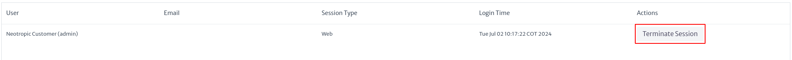

# Gestor de Sesiones

Ofrece a los usuarios la capacidad de visualizar y gestionar las sesiones activas dentro de la aplicación. Para acceder a este módulo, diríjase al menú superior de la pantalla y haga clic en el ícono . Al hacerlo, se desplegará un menú vertical donde podrá seleccionar la opción `Session Manager`.

> **Importante.** Esta funcionalidad es esencial para que los administradores puedan monitorear y controlar las sesiones activas en tiempo real, garantizando así la seguridad y eficiencia en el uso de la aplicación. Por lo tanto, se recomienda que el acceso a este módulo esté restringido únicamente a usuarios con permisos administrativos.

|  |
| :--: |
| ***Figura 1.** Acceso al módulo de gestor de sesiones.* |

|  |
| :--: |
| ***Figura 2.** Módulo d gestor de sesiones.* |

Al acceder al módulo, aparece una interfaz como la mostrada en la Figura 2, con una lista de todas las sesiones activas. A continuación, se describen las columnas y acciones disponibles en esta interfaz:

* **User.** Esta columna muestra el nombre del usuario.
* **Email.** Esta columna muestra la dirección de correo electrónico asociada con cada usuario en caso de que haya sido definido por el usuario.
* **Session Type.** Indica el tipo de sesión iniciada.
* **Login Time.** Muestra la fecha y hora en que la sesión fue iniciada.
* **Actions.** Esta columna proporciona opciones para gestionar la sesión. En la imagen, se muestra un botón etiquetado "Terminate Session", que permite al administrador finalizar la sesión activa del usuario correspondiente.

No es posible que un usuario finalice su propia sesión mediante el módulo "Session Manager". En su lugar, el usuario debe cerrar sesión haciendo clic en el botón `Logout`.