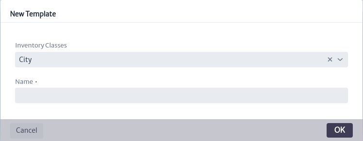
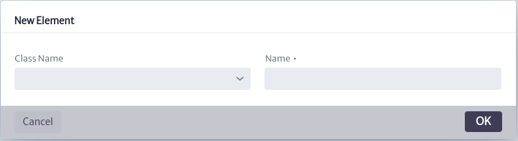
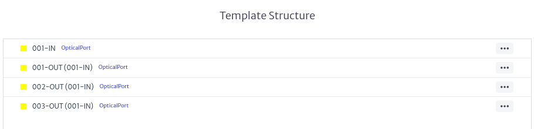
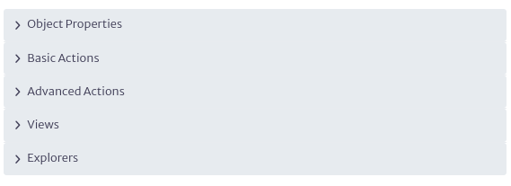
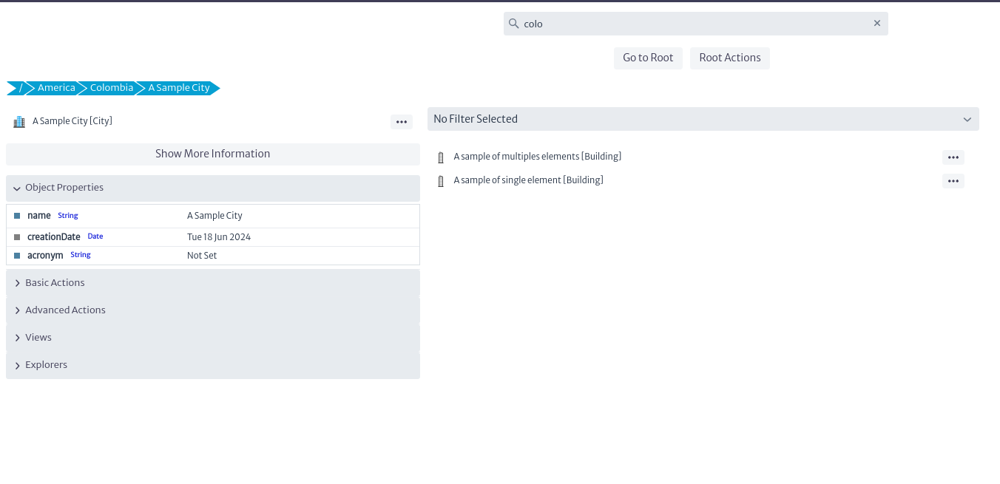

# Template Manager

En muchos escenarios existen algunas estructuras de contención (ver Administrador de Contenecia) que se crean de forma recurrente, como `Building → Floor → Room → Rack`, o `ODF/DDF` con el mismo número de puertos `(24/12/36/48/72/96/144)`, o simplemente equipos con el mismo conjunto de atributos, por ejemplo todos los enrutadores de un determinado modelo: El proveedor, ranuras, etc. serán siempre los mismos. Crear cada vez estos elementos desde cero seria una tarea tediosa. Por este motivo Kuwaiba proporciona el módulo de gestión de plantillas, que permite la creación de plantillas de objetos a partir de elementos reales del inventario.

El modulo de gestión de plantillas en la Figura 1 pertenece a la categoría de `Administration`.

|  |
|:--:|
| ***Figure 1.** Template manager module* |

## Creación de una plantilla  

Una vez abierto el modulo, para crear una plantilla debe seleccionar la clase para la cual desea crear la plantilla en el selector de la parte superior izquierda de la ventana principal del modulo como se muestra en la Figura 2.

|  |
|:--:|
| ***Figure 2.** Template manager selecting class* |

Puede seleccionar cualquiera de las clases disponibles en la aplicación a excepción de las clases abstractas y las de tipo de lista, debido a que no se pueden crear elementos de dichas clases.

Una vez elegida la clase proceda a crear la plantilla utilizando el botón  se abrirá la ventana de creación de plantillas de la Figura 3. Donde deberá seleccionar la clase si aun no lo hizo y el nombre que asignara a la plantilla, utilice un nombre descriptivo debido a que este sera el que veras en la lista de plantillas disponibles.

|  |
|:--:|
| ***Figure 3.** Template creation window* |

Una vez creada la plantilla esta aparecerá en la lista de plantillas creadas para la clase seleccionada junto con sus acciones, como se ve en la Figura 4.

|  |
|:--:|
| ***Figure 4.** Template list* |

## Acciones de plantilla 

### Eliminar una plantilla

Es posible eliminar las plantillas creadas para una clase, para hacerlo utilice el botón  entre las acciones de la plantilla de la Figura 4, que abrirá la ventana de eliminación de plantillas de la Figura 5, pulse `OK` para eliminarla o `CANCEL` si no desea hacerlo.

|  |
|:--:|
| ***Figure 5.** Template delete window* |

### Agregar elementos

Se pueden agregar `elementos` o `elementos especiales` a las plantillas. Los elementos que pueden ser agregados están determinados por la configuración de contenencia de la clase (ver Administrador de Contenencia). 

Para añadir `elementos` a la clase, utilice el botón  en las acciones de la plantilla mostradas en la Figura 4. Si desea añadir `elementos especiales`, use el botón . Esto desplegará el menú mostrado en la Figura 6, donde deberá seleccionar si desea crear un solo elemento o múltiples elementos. Si la clase no tiene asignados ningún elemento o elemento especial en su contenencia, no podrá agregar elementos de este tipo a la plantilla.

|  |
|:--:|
| ***Figure 6.** Elements options menu* |

#### Crear un solo elemento

Si selecciono la creación de un solo elemento en el menu de la Figura 6, se abrirá la ventana de creación de un solo elemento de la Figura 7. Donde deberá asignar un nombre al elemento y elegir la clase del elemento a agregar, las clases disponibles dependen de la configuración de contenencia de la clase a la cual le creara el elemento (ver Administrador de Contenencia).

|  |
|:--:|
| ***Figure 7.** Single element creation window* |

#### Crear elementos multiples 

Si selecciono la creación de elementos multiples en el menu de la Figura 6, se abrirá la ventana de creación de elementos multiples de la Figura 8. 

|  |
|:--:|
| ***Figure 8.** Multiple elements creation window* |

Donde deberá elegir la clase del elemento a agregar, las clases disponibles dependen de la configuración de contenencia de la clase a la cual le creara el elemento (ver Administrador de Contenencia) e introducir el `patron de denominación` como se explica a detalle en el apéndice a.

El resultado del uso del `patron de denominación` [sequence(a,c)] util para la creación de multiples elementos como edificios en la clase `City` y [multiple-mirror(1,3)] util para la creación de puertos en la clase `SpliceBox` se pueden apreciar en la Figura 9 y 10 respectivamente.

|  |
|:--:|
| ***Figure 9.** Result of [sequence(a,c)]* |

|  |
|:--:|
| ***Figure 10.** Result of [multiple-mirror(1,3)]* |

## Gestión de elementos de plantilla 

Una vez creados los elementos de la plantilla estos se serán añadidos en la sección `estructura de la plantilla` de la venta principal del modulo como se muestra en la Figura 11. 

|  |
|:--:|
| ***Figure 11.** List of elements* |

En ella no solo se pueden visualizar los `elementos`,  el árbol de contenencia de los `elementos multiples` sino también crear `elementos` o `elementos especiales` sobre los ya existentes o eliminarlos utilizando el botón  del elemento deseado que desplegara el menu de la Figura 12.

|  |
|:--:|
| ***Figure 12.** Manage elements menu* |

De esta manera se pueden crear estructuras de contenencia tan complejas como se desee siguiendo la configuración de contenencia de la clase a la cual se le crea la plantilla como se ve en la Figura 13.

|  |
|:--:|
| ***Figure 13.** Template Example* |

## Editar propiedades de una plantilla o elementos

Es posible editar las propiedades o elementos de una plantilla una vez hayan sido creados, para ello seleccione la plantilla o un elemento de la plantilla que desee editar, en la parte derecha de la ventana principal del modulo aparecerá la hoja de propiedades de la plantilla Figura 14 o de los elementos de la plantilla Figura 15 úselo para editar las propiedades deseadas.

|  |
|:--:|
| ***Figure 14.** Example of template property sheet* |

|  |
|:--:|
| ***Figure 15.** Example of element property sheet* |

## Uso de la plantilla

Se pueden crear objetos utilizando las plantillas creadas en el administrador de plantillas desde cualquier modulo de Kuwaiba que tenga disponible el `panel de opciones de objeto` de la Figura 16, como por ejemplo en los módulos de navegación, grupos, etc.

|  |
|:--:|
| ***Figure 16.** Object options panel* |

En el apartado `opciones básicas` del `panel de opciones de objeto` encontramos las opciones `Nuevo objecto desde plantilla` y `Nuevo objecto Especial desde plantilla` como se muestra en la Figura 17.

|  |
|:--:|
| ***Figure 17.** Options to create objects from template* |

Al usarlos se desplegará la ventana de creación de objectos desde plantilla de la Figura 18. Las clases disponibles dependen de la configuración de contenencia de la clase seleccionada. 

|  |
|:--:|
| ***Figure 18.** Object creation window from template* |

Para el ejemplo utilizamos la clase `City` y la plantilla antes creada `A sample city`, como resultado obtenemos la creación de un objeto siguiendo la plantilla como se observa en la Figura 19.

|  |
|:--:|
| ***Figure 19.** Example object created from template* |