# Validadores

Los validadores son banderas que indican el estado, condición o ciertas características sobre objetos específicos dentro de un sistema o contexto. Estas banderas pueden adoptar la forma de porcentajes, mensajes de estado, entre otros. Los validadores se utilizan para proporcionar información rápida y fácilmente interpretable sobre los objetos de las clases a los que están asociados.

Para acceder al módulo de validadores, localice en el menú superior de la pantalla la categoría `Settings`, representada por el símbolo . Al hacer clic, se desplegará un segundo menú. Seleccione la opción `Validator Definition`, lo que abrirá la interfaz del módulo de validadores, como se muestra en la Figura 2.

| 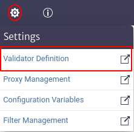 |
| :--: |
| ***Figura 1.** Ingreso al modulo de validadores.* |

| 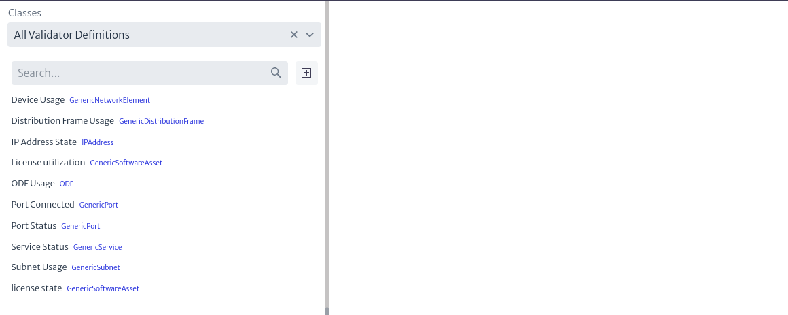 |
| :--: |
| ***Figura 2.** Validadores.* |

Como se observa en la Figura 2, en la interfaz inicial del módulo aparece una lista en la parte izquierda con todos los validadores existentes. En la parte superior, en la caja de búsqueda marcada con `Classes`, se pueden filtrar los validadores por la clase a la que pertenecen. Al seleccionar el icono 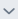, se mostrará una lista con todas las clases. De igual forma, puede escribir el nombre de la clase de interés en la caja de búsqueda, y la lista se actualizará de acuerdo con lo que ingrese en el campo, como se muestra en la Figura 3.

| 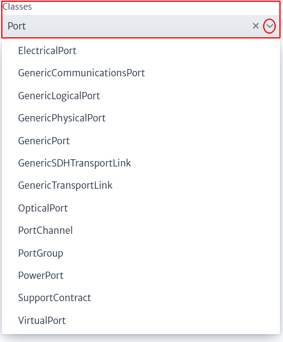 |
| :--: |
| ***Figura 3.** Búsqueda de validadores por clase.* |

Como se mencionó anteriormente, al realizar la búsqueda unicamente se muestran los validadores pertenecientes a una clase seleccionada, como indica la Figura 4.

| 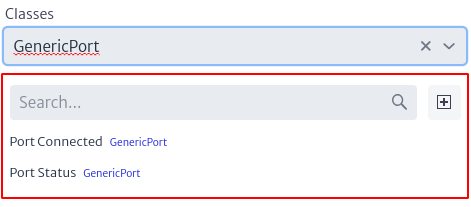 |
| :--: |
| ***Figura 4.** Filtro de validadores por clase.* |

De igual forma, el módulo cuenta con una segunda caja de búsqueda, indicada en la Figura 5. Esta caja permite buscar validadores que coincidan con los términos ingresados, de acuerdo a la lista de validadores presentes.

| 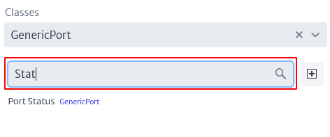 |
| :--: |
| ***Figura 5.** Búsqueda de filtros por nombre.* |

Para agregar un nuevo validador, se selecciona el icono 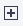 mostrado en la Figura 2. Esto abrirá una ventana emergente, similar a la indicada en la Figura 6, donde el usuario puede seleccionar la clase a la que pertenece el validador, ingresar su nombre y añadir una descripción.

| 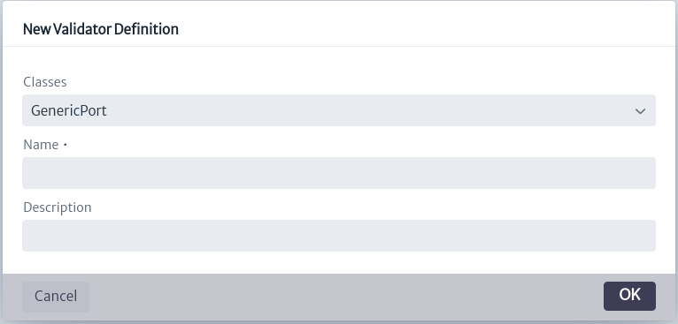 |
| :--: |
| ***Figura 6.** Crear validador.* |

Al seleccionar un validador de interés, el script será mostrado en la parte derecha de la pantalla, como muestra la Figura 7. 

| 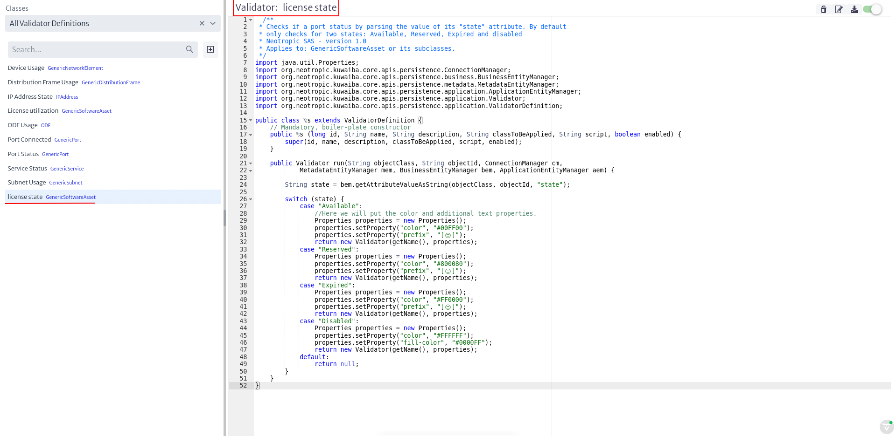 |
| :--: |
| ***Figura 7.** Vista del validador seleccionado.* |

Para el ejemplo de la Figura 7, se seleccionó el validador `license state`. En el recuadro rojo se indica el nombre del validador. Justo debajo, se muestra el contenido del validador, el cual será explicado en la subsección SUB. En la parte superior derecha se encuentran cuatro botones, los cuales se detallan en la Figura 8.

|  |
| :--: |
| ***Figura 8.** Opciones del validador.* |

* El icono  elimina un validador.
* El icono  permite modificar el nombre y la descripción del validador, desplegando una ventana como la mostrada en la Figura 9.

    | 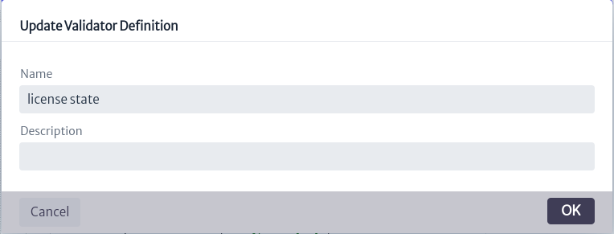 |
    | :--: |
    | ***Figura 9.** Ventana de actualización de propiedades del validador.* |

* El icono  guarda los cambios realizados en el script del validador.
* El icono  permite habilitar o deshabilitar el validador. Un validador deshabilitado, no será tomado en cuenta como validador de un objeto.

## Contenido de un Validador

Un validador se representa como una clase que se adiciona al `classpath` de la aplicación.

> **Importante.** Los validadores se ejecutan cada que se abstrae información de un objeto, por ello es recomendable no agregar una lógica muy compleja al validador ya que puede generar impactos significativos de rendimiento.

|  |
| :--: |
| ***Figura 10.** Contenido del validador.* |

Tomando como ejemplo el validador de la Figura 7 (cuyo contenido se aprecia mejor en la Figura 10), un validador sigue las siguientes reglas:

* Todos los validadores extienden de la clase `ValidatorDefinition`. Esto se puede apreciar en la linea 15 de la Figura 10. **No debe ser modificado por el usuario**.
* Todos los validadores cuentan con un constructor que **no debe ser modificado por el usuario**, es decir, siempre es el mismo.
* Cuenta con un método `run`, el cual inyecta los entity managers de la aplicación (ApplicationEntityManager, BusinessEntityManager, MetadataEntityManager), el ConnectionManager y el identificador del objeto y la clase a la cual pertenece. La firma de este método no debe ser modificada. El usuario puede alterar su contenido, ya que es dentro de este método donde se agrega el contenido de valor del validador. Dicha inyección permite utilizar los métodos de los entity managers para construir la logica del filtro. La documentación la encuentra la API Java documentada de Kuwaiba[^API].
* Existen cuatro formas de establecer un validador:
  * **Sufijo:** Agrega un texto después del nombre del objeto. La propiedad es denominada `suffix`.
  * **Prefijo:** Agrega un texto antes del nombre del objeto. La propiedad es denominada `prefix`.
  * **Color:** Cambia el color del texto. La propiedad es denominada `color`.
  * **Color de fondo:** Cambia el color de fondo. La propiedad es denominada `fill-color`.
  
  Para establecer las propiedades del validador, haga uso del Properties, como muestra la linea 29 de la Figura 10. Ya que funciona como un HashMap, en donde la llave es la propiedad que quiere establecer y el valor es el valor que le quiere dar, por ejemplo: `Properties.setProperties("color", "#00FF00")`.

En el modulo de Navegación, se pueden observar los validadores agregados, ya que como se mencionó anteriormente, los validadores se retornan junto con la información de un objeto determinado.

| 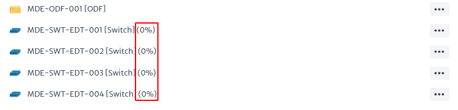 |
| :--: |
| ***Figura 11.** Objetos con validadores.* |

En la Figura 11 se señala con el recuadro rojo los validadores, agregados como sufijo al nombre de los objetos.

Puede observar algunos ejemplos de validadores en SourceForge[^SourceForgeScripts]. Los scripts de validadores inician con `VD` en su nombre.

  [^API]: Kuwaiba Persistence API: https://kuwaiba.org/docs/dev/javadoc/current/
  [^SourceForgeScripts]: Scripts de validadores en SourceForge: https://sourceforge.net/p/kuwaiba/code/HEAD/tree/server/trunk/scripts/